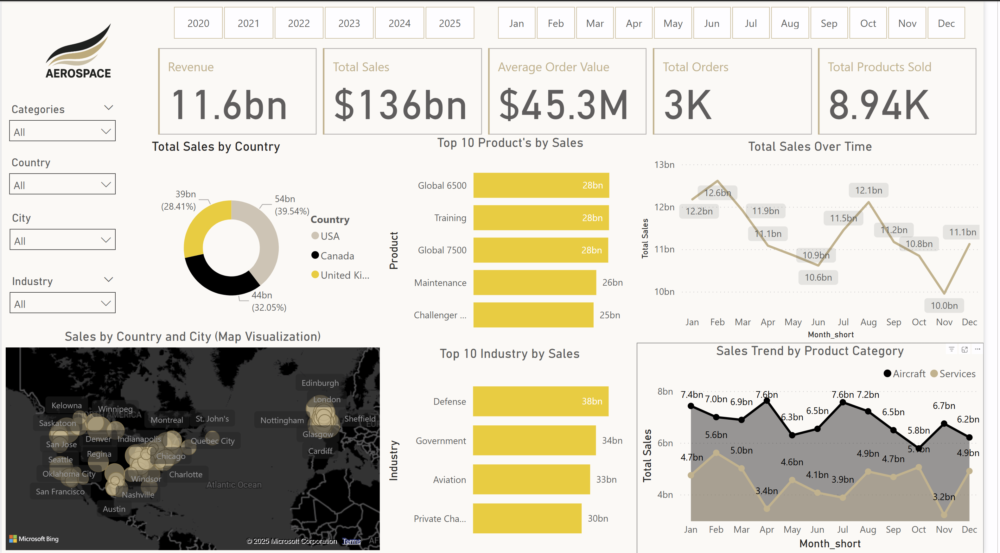

🚀 Aerospace Power BI Dashboard (Fictitious Data)

This project showcases an interactive Power BI dashboard designed to visualize and analyze sales, customer, and product performance data for a fictitious aerospace company, Aerospace. It demonstrates advanced data modeling, transformation, and storytelling using Power BI, DAX, and Power Query.

📁 Project Structure

PowerBI-Aerospace-Project/
├── screenshots/
│   ├── dashboard_overview.png
│   ├── Customer_Breakdown.png
│   ├── data_model.png
│   ├── Regional_Sales_Budget.png
├── datasets/
│   ├── aerospace_Budget_Finalized.xlsx
│   ├── aerospace_Calendar_Finalized.xlsx
│   ├── aerospace_Customers_Finalized.xlsx
│   ├── aerospace_Products_Finalized.xlsx
│   ├── aerospace_Sales_Finalized.xlsx
├── aerospace_Insights_Fictional dataset.pptx
├── README.md
└── aerospace logo.png

🧾 Overview

Tool: Power BI Desktop

Model: Star Schema

Data Sources: Simulated datasets (Sales, Products, Customers, Budget, Calendar)

Metrics: Revenue, Sales Trend, Customer Distribution, Budget vs Actuals, Top Products

📊 Dashboard Highlights

🔹 Dashboard Overview

This is the main dashboard with global KPIs, filters by year, country, category, and an at-a-glance view of key performance indicators.

Total Products Sold, Orders, Sales, Revenue

Filters for Year, Month, Country, City

KPI Cards and Donut Charts showing category, industry, and country breakdowns

🔹 Sales Trend by Product Category

A monthly trend line tracking performance for Aircraft and Services categories.

Seasonal dips and spikes clearly visible

Useful for detecting underperforming months or budgeting misalignments

🔹 Total Sales by Product and Industry

This visual highlights how each product contributes to industry-wise revenue.

Stack bar chart per industry (Defense, Government, Aviation, Private Charters)

Products like Global 7500 and Annual Maintenance drive consistent revenue

🧹 Data Cleaning & Transformation

Performed in Power Query:

Renamed columns for clarity and consistency

Removed nulls and duplicates

Formatted dates to match reporting standards

Created custom columns for Month, Year, and Month_Short for grouping

Ensured categorical fields (e.g., Product Category, Customer Type) were standardized for filtering

---
🧩 Data Modeling (Star Schema)
Fact Table: Sales

Dimension Tables: Customers, Products, Calendar, Budget

Relationships are 1-to-many (e.g., Customers → Sales)

Time intelligence enabled via Calendar table

🖼 Report Screenshots

You can add screenshots of your report visuals here to visually showcase your dashboard design and insights:

🔸 Report Page 1: Overview Dashboard

🔸 Report Page 2: Customer Breakdown

🔸 Report Page 3: Regional Sales & Budget

🔸 Report Page 4: Data Model in Power BI

🧠 Insights & Findings

- USA contributes the largest revenue share (~39.5%)

- Corporate Customers dominate with ~38bn in sales

- Top Products: Global 7500, Global 6500, and Pilot Training

- Budget and actual sales show divergence in Q2 and Q3

🛠 Tools & Techniques Used

- Power BI Desktop: Report creation, modeling, and visualizations

- Power Query (M): Data cleaning and prep

- DAX: For calculated columns and KPIs (e.g., Average Order Value, Total Sales)

- Bing Maps: For geospatial visuals (Sales by City)